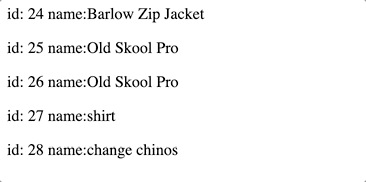

## C# Admin server with .NET Core

This application has a .NET C# REST API backend that fetches data from a MySQL DB that interacts with a React Application that allows you create new entries, read, delete, and update to the MySQL DB.

## CRUD Methods

## Read

This demonstrates that my front end react application was able to fetch data from my .NET backend


## Create

Here is a giphy for create


## Update

Here is a giphy for update


## Delete

Here is a giphy for delete



## Tech/framework used

<b>Built with</b>

- [React](https://reactjs.org/)
- [C#](https://docs.microsoft.com/en-us/dotnet/csharp/)
- [.NET](https://docs.microsoft.com/en-us/dotnet/)

## How to use?

Clone this repo and then in the C# files I would change the generic connection string I put in the startup file to your DB that you like to connect. Next follows the instructions below starting in the root of the project.

In the terminal run

```bash
cd backend
dotnet run
```

Now open a new terminal and run

```bash
cd frontend
npm run start
```

Then they will be communicating with each other.

## License

MIT © [Jonathan Giler]()
