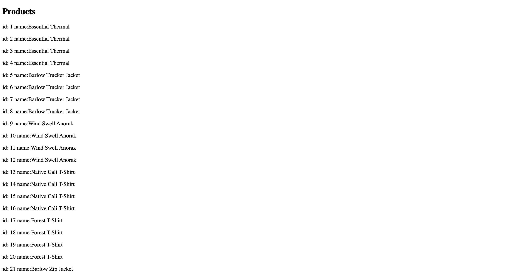
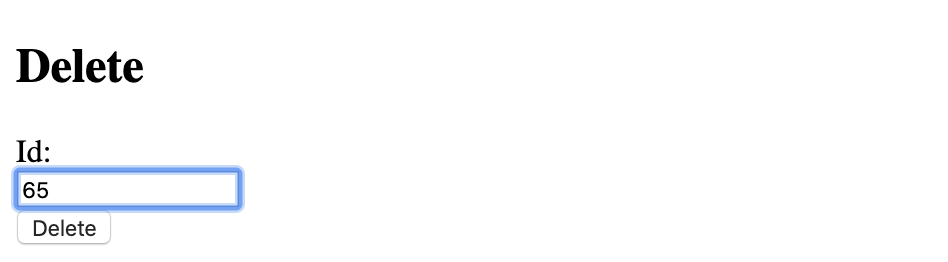

## C# Admin server with .NET Core
This application has a .NET C# REST API backend that fetches data from a MySQL DB that interacts with a React Application that allows you create new entries, read, delete, and update to the MySQL DB.
 
## CRUD Methods

## Read
This demonstrates that my front end react application was able to fetch data from my .NET backend


## Create
Before I created a new product


After I created a new product it was added to the list of all products


## Update
Updating the new item I added to MySQL db to Poisedon from Zues 


## Delete
Before deleting 

Deleting item 65

After deleting the item its no longer being displayed


## Tech/framework used

<b>Built with</b>
- [React](https://reactjs.org/)
- [C#](https://docs.microsoft.com/en-us/dotnet/csharp/)
- [.NET](https://docs.microsoft.com/en-us/dotnet/)

## How to use?
Clone this repo and then in the C# files I would change the generic connection string I put in the startup file to your DB that you like to connect then from there run the application. While thats running open a terminal and be inside the frontend dir and run 
```
npm run start
```
Then they will be communicating with each other.

## License

MIT © [Jonathan Giler]()

